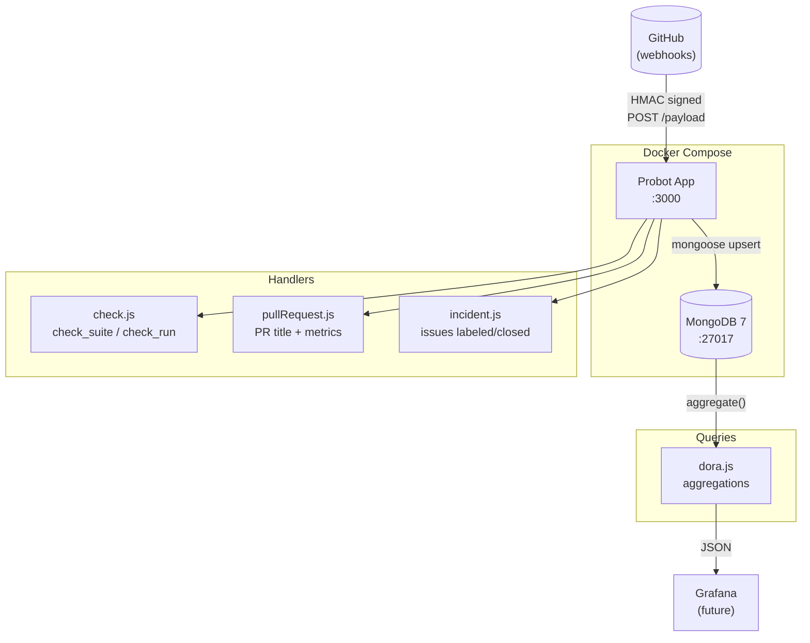
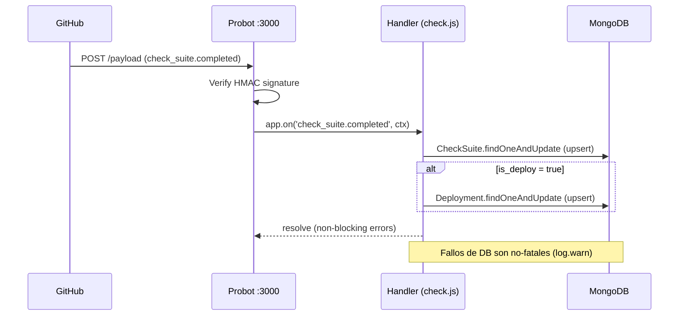
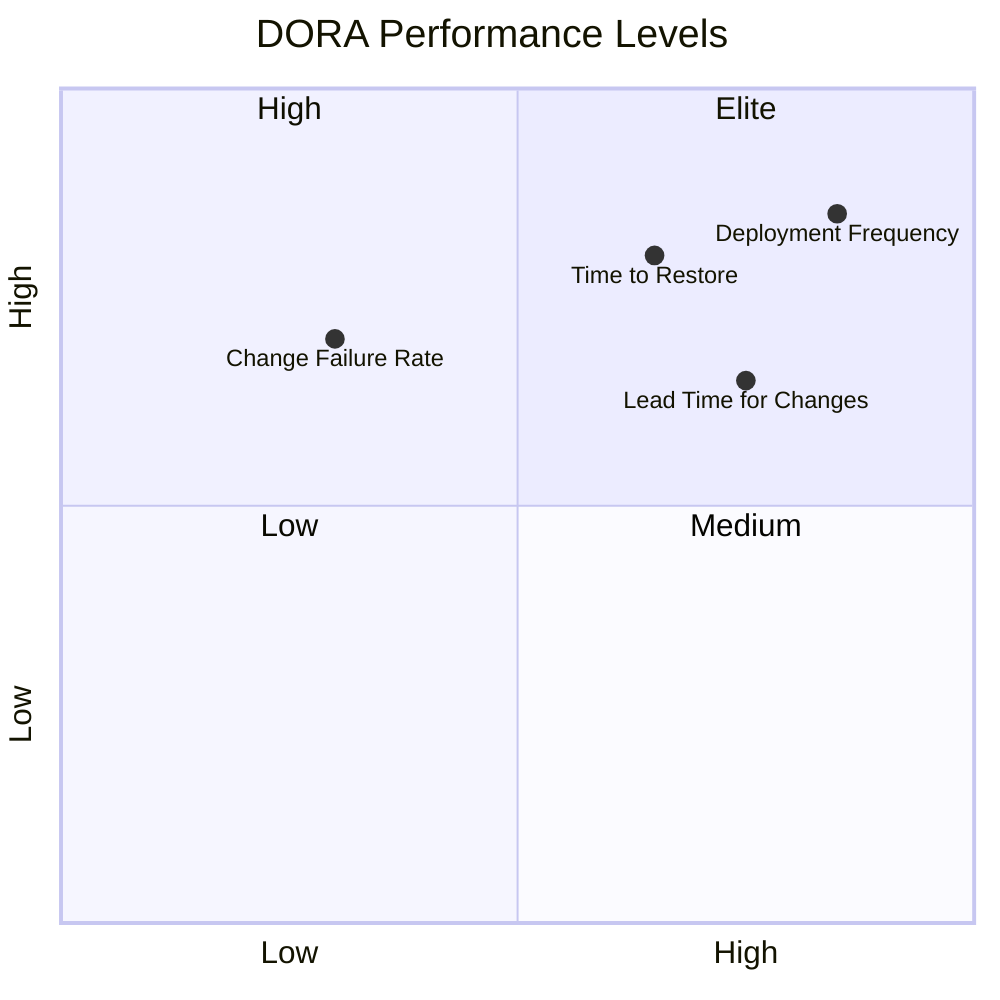
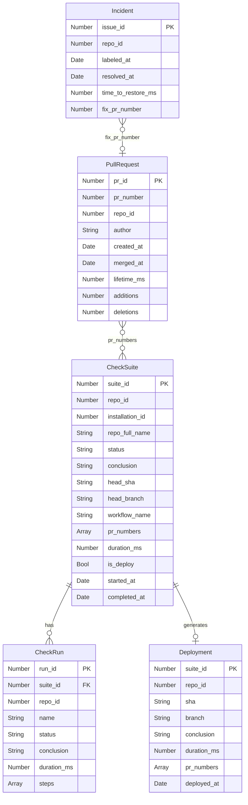
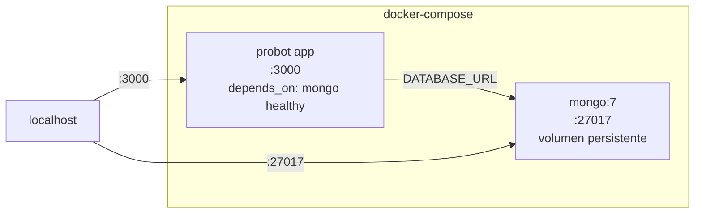
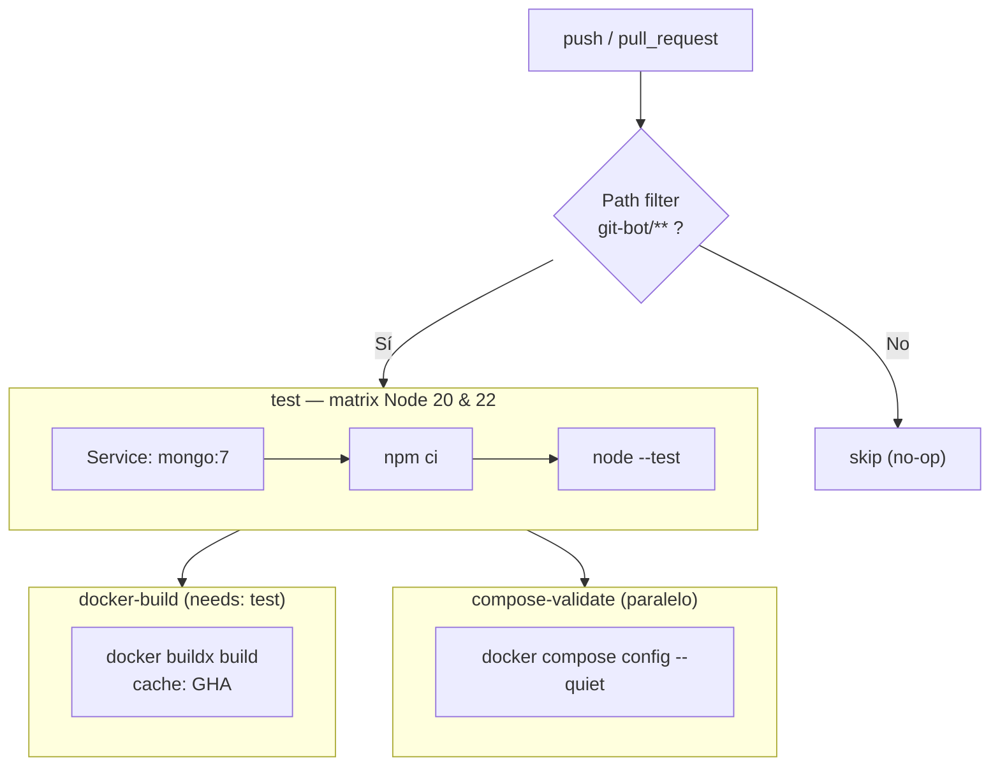

# git-bot — DORA Metrics para GitHub Actions

GitHub App construida con [Probot](https://probot.github.io) + Node.js 20 que captura métricas DORA (y extras) de todos tus repositorios en tiempo real, persiste en MongoDB y expone queries listos para Grafana.

> **Stack**: Probot 13 · Mongoose 8 · MongoDB 7 · Docker Compose · Node ≥ 18 · ISC License

---

## Tabla de contenidos

- [Arquitectura](#arquitectura)
- [Qué hace](#qué-hace)
- [Métricas DORA](#métricas-dora)
- [Modelo de datos](#modelo-de-datos)
- [Estructura del proyecto](#estructura-del-proyecto)
- [Inicio rápido](#inicio-rápido)
- [Docker Compose](#docker-compose)
- [GitHub App — Configuración](#github-app--configuración)
- [Variables de entorno](#variables-de-entorno)
- [CI/CD](#cicd)
- [Queries DORA](#queries-dora)
- [License](#license)

---

## Arquitectura



---

## Qué hace

### Handlers registrados

| Evento GitHub                         | Acción GitHub API                     | Persistencia DORA                                                             |
| ------------------------------------- | ------------------------------------- | ----------------------------------------------------------------------------- |
| `check_suite.requested`               | `checks.create` "My app!"             | Upsert `checksuites`                                                          |
| `check_suite.completed`               | —                                     | Update suite + `duration_ms`; si workflow es `deploy*` → upsert `deployments` |
| `check_run.rerequested`               | `checks.create` re-check              | —                                                                             |
| `check_run.completed`                 | —                                     | Upsert `checkruns`                                                            |
| `pull_request.opened/edited/reopened` | Check título `[TIPO] Desc [JIRA-NNN]` | —                                                                             |
| `pull_request.closed`                 | —                                     | Upsert `pullrequests` con `lifetime_ms`                                       |
| `issues.labeled` (`incident`)         | —                                     | Crea registro `incidents` con `labeled_at`                                    |
| `issues.closed`                       | —                                     | Resuelve incident, calcula `time_to_restore_ms`                               |
| `workflow_run` / `workflow_job`       | —                                     | Log estructurado DEBUG                                                        |

### Flujo de un evento



### Validación de título de PR

El bot bloquea PRs cuyo título no cumpla el formato:

```
[TIPO] Descripción libre [JIRA-NNN]
```

Tipos válidos: `FIX` · `FEAT` · `CHORE` · `DOCS` · `REFACTOR` · `TEST`

---

## Métricas DORA



| Métrica                    | Fuente de datos                                | Colección Mongo | Nivel Elite   |
| -------------------------- | ---------------------------------------------- | --------------- | ------------- |
| **Deployment Frequency**   | `check_suite.completed` en workflows `deploy*` | `deployments`   | Múltiples/día |
| **Lead Time for Changes**  | `duration_ms` de suites de deploy              | `checksuites`   | < 1 hora      |
| **Change Failure Rate**    | `conclusion: failure` / total suites           | `checksuites`   | < 15 %        |
| **Time to Restore (MTTR)** | `labeled_at` → `resolved_at` en issues         | `incidents`     | < 1 hora      |
| PR Lifetime _(bonus)_      | `created_at` → `merged_at`                     | `pullrequests`  | —             |
| Failed Jobs _(bonus)_      | `check_run.conclusion: failure`                | `checkruns`     | —             |

---

## Modelo de datos



---

## Estructura del proyecto

```
git-bot/                         ← raíz del repositorio
├── .github/
│   └── workflows/
│       ├── ci.yml               ← tests + docker build + compose validate
│       ├── ai-disclosure.yaml   ← EU AI Act Art.50 auto-update
│       └── ci-ai-compliance.yaml
├── docker-compose.yml           ← probot + mongo (volúmenes persistentes)
├── docs/
│   ├── probot.md
│   └── use-cases.md
└── git-bot/                     ← código de la app
    ├── Dockerfile               ← node:20-slim, npm ci --production
    ├── index.js                 ← entry point (probot run ./index.js)
    ├── package.json             ← probot@13 + mongoose@8
    ├── app.yml                  ← permisos y eventos del GitHub App
    ├── .env.example
    └── src/
        ├── db.js                ← conexión Mongoose (non-fatal si Mongo está caído)
        ├── models/
        │   ├── CheckSuite.js
        │   ├── CheckRun.js
        │   ├── PullRequest.js
        │   ├── Deployment.js
        │   └── Incident.js
        ├── handlers/
        │   ├── check.js         ← check_suite.* + check_run.*
        │   ├── pullRequest.js   ← PR title check + pull_request.closed
        │   └── incident.js      ← issues.labeled/closed + fix PR linking
        └── queries/
            └── dora.js          ← 7 funciones de agregación DORA
```

---

## Inicio rápido

### Requisitos

- Node.js ≥ 18
- Docker + Docker Compose (para MongoDB local)
- Cuenta GitHub + GitHub App creada

### 1. Clonar e instalar

```bash
git clone <repo>
cd git-bot/git-bot
npm install
```

### 2. Configurar el `.env`

```bash
cp .env.example .env
# Editar con tus valores reales
```

```env
APP_ID=123456
PRIVATE_KEY_PATH=./private-key.pem      # descarga desde GitHub App settings
WEBHOOK_SECRET=un_secreto_seguro
WEBHOOK_PROXY_URL=https://smee.io/xxxx  # para desarrollo local
DATABASE_URL=mongodb://localhost:27017/probot_metrics
INCIDENT_LABEL=incident
LOG_LEVEL=debug
```

### 3. Arrancar MongoDB local

```bash
# Desde la raíz del repo
docker compose up mongo -d
```

### 4. Arrancar el bot en modo dev (hot-reload)

```bash
cd git-bot
npx nodemon --watch src --watch index.js index.js
```

---

## Docker Compose

Levanta la stack completa (probot + mongo) desde la raíz del repo:

```bash
docker compose up --build
```



| Servicio | Imagen              | Puerto | Volumen                          |
| -------- | ------------------- | ------ | -------------------------------- |
| `mongo`  | `mongo:7`           | 27017  | `mongo_data:/data/db`            |
| `probot` | `./git-bot` (build) | 3000   | `./git-bot/private-key.pem` (ro) |

El servicio `probot` arranca solo cuando `mongo` supera su healthcheck (`db.adminCommand('ping')`).

---

## GitHub App — Configuración

### Permisos requeridos

| Permiso         | Nivel   | Para qué                      |
| --------------- | ------- | ----------------------------- |
| `checks`        | `write` | Crear y actualizar check runs |
| `actions`       | `read`  | Leer info de workflows        |
| `metadata`      | `read`  | Metadata de repos             |
| `issues`        | `read`  | Eventos de incidentes         |
| `pull_requests` | `read`  | Métricas de PRs               |

### Eventos suscritos

`check_run` · `check_suite` · `workflow_run` · `workflow_job` · `pull_request` · `issues`

### Pasos para instalar en tus repos

1. Arrancar el bot (`npm start` o `docker compose up`)
2. Ir a `https://github.com/apps/<nombre-de-tu-app>`
3. Click **Install** → selecciona los repositorios objetivo
4. El bot empieza a recibir webhooks inmediatamente

> Para desarrollo local usa [smee.io](https://smee.io/new) como proxy de webhooks y ponlo en `WEBHOOK_PROXY_URL`.

---

## Variables de entorno

| Variable                           | Requerida | Default                                    | Descripción                         |
| ---------------------------------- | --------- | ------------------------------------------ | ----------------------------------- |
| `APP_ID`                           | Sí        | —                                          | ID de tu GitHub App                 |
| `PRIVATE_KEY` / `PRIVATE_KEY_PATH` | Sí        | —                                          | Clave privada RSA                   |
| `WEBHOOK_SECRET`                   | Sí        | `development`                              | Secret del webhook                  |
| `WEBHOOK_PROXY_URL`                | Dev       | —                                          | URL smee.io para dev local          |
| `DATABASE_URL`                     | No        | `mongodb://localhost:27017/probot_metrics` | URI de MongoDB                      |
| `INCIDENT_LABEL`                   | No        | `incident`                                 | Label que abre un incident          |
| `LOG_LEVEL`                        | No        | `info`                                     | `trace` · `debug` · `info` · `warn` |
| `NODE_ENV`                         | No        | —                                          | `production` en Docker              |

---

## CI/CD

El workflow [`.github/workflows/ci.yml`](.github/workflows/ci.yml) corre en push a `main`/`develop` y en PRs (solo cuando cambia `git-bot/**` o `docker-compose.yml`).



| Job                | Depende de      | Valida                                             |
| ------------------ | --------------- | -------------------------------------------------- |
| `test`             | MongoDB service | Unit tests con `node --test` en Node 20 y 22       |
| `docker-build`     | `test`          | Imagen buildea sin errores (`npm ci --production`) |
| `compose-validate` | —               | Sintaxis correcta del `docker-compose.yml`         |

---

## Queries DORA

```bash
mongosh mongodb://localhost:27017/probot_metrics
```

### Deployment Frequency

```js
db.deployments.aggregate([
  { $match: { conclusion: "success" } },
  {
    $group: {
      _id: {
        repo: "$repo_full_name",
        day: { $dateToString: { format: "%Y-%m-%d", date: "$deployed_at" } },
      },
      n: { $sum: 1 },
    },
  },
  {
    $group: {
      _id: "$_id.repo",
      total: { $sum: "$n" },
      avg_per_day: { $avg: "$n" },
    },
  },
]);
```

### Lead Time for Changes

```js
db.checksuites.aggregate([
  {
    $match: {
      is_deploy: true,
      conclusion: "success",
      duration_ms: { $ne: null },
    },
  },
  {
    $group: {
      _id: "$repo_full_name",
      avg_min: { $avg: { $divide: ["$duration_ms", 60000] } },
      count: { $sum: 1 },
    },
  },
]);
```

### Change Failure Rate

```js
db.checksuites.aggregate([
  { $match: { status: "completed" } },
  {
    $group: {
      _id: "$repo_full_name",
      total: { $sum: 1 },
      failed: {
        $sum: {
          $cond: [{ $in: ["$conclusion", ["failure", "timed_out"]] }, 1, 0],
        },
      },
    },
  },
  {
    $project: {
      cfr_pct: { $multiply: [{ $divide: ["$failed", "$total"] }, 100] },
    },
  },
]);
```

### Time to Restore (MTTR)

```js
db.incidents.aggregate([
  { $match: { resolved_at: { $ne: null } } },
  {
    $group: {
      _id: "$repo_full_name",
      avg_ttr_h: { $avg: { $divide: ["$time_to_restore_ms", 3600000] } },
      count: { $sum: 1 },
    },
  },
]);
```

### PR Lifetime

```js
db.pullrequests.aggregate([
  { $match: { merged_at: { $ne: null } } },
  {
    $group: {
      _id: "$repo_full_name",
      avg_h: { $avg: { $divide: ["$lifetime_ms", 3600000] } },
      prs: { $sum: 1 },
    },
  },
]);
```

> Las mismas queries están disponibles como funciones exportables en [`git-bot/src/queries/dora.js`](git-bot/src/queries/dora.js) para usar desde Node o preparar un dashboard de Grafana.

---

## License

[ISC](git-bot/LICENSE) © 2026 VanOps & Probot Contributors
