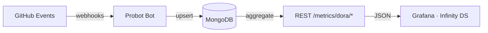
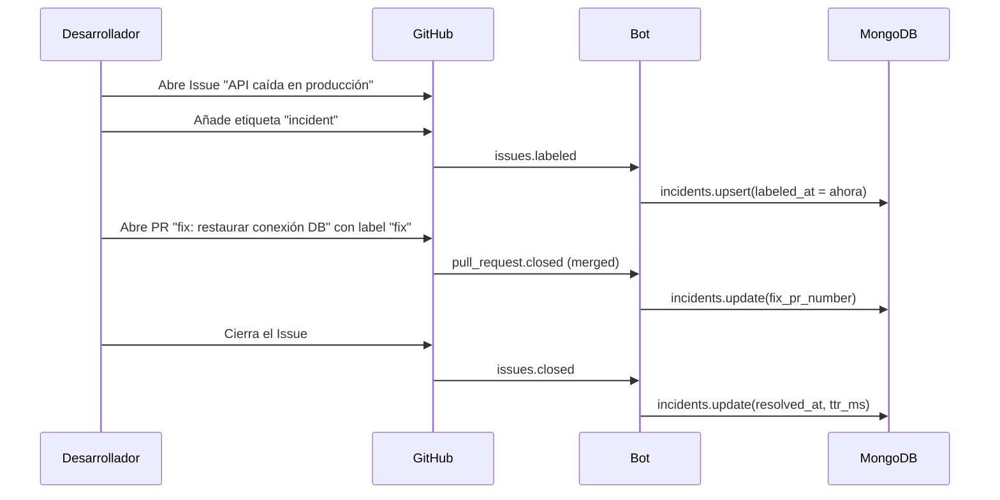

# DORA Metrics – Guía de Configuración y Estándares

Esta guía explica cómo el bot recopila las cuatro métricas DORA (y PR Lifetime como métrica bonus), qué convenciones de nombres **debes seguir** para que los datos lleguen a Grafana, y ejemplos concretos para cada caso.

> Esta guía cubre exclusivamente las métricas DORA. Para estadísticas genéricas de workflows (todos los repos y pipelines) consulta el dashboard **Workflow Statistics** en Grafana (`uid: workflow-stats-v1`) y los endpoints `/metrics/workflows/*`.

---

## Cómo fluyen los datos



El bot escucha cinco tipos de eventos de GitHub:

| Evento GitHub | Colección MongoDB | Métrica DORA |
|---|---|---|
| `workflow_run.completed` | `checksuites` + `deployments` | Deployment Frequency, Lead Time |
| `check_suite.completed` | `checksuites` | CFR (todos los suites, no solo deploys) |
| `pull_request.closed` | `pullrequests` | PR Lifetime |
| `issues.labeled` | `incidents` | MTTR |
| `issues.closed` | `incidents` | MTTR |

> **Por qué dos eventos de checks:** `check_suite.app.name` siempre es `"GitHub Actions"` — no contiene el nombre real del workflow. El nombre real (`"Deploy – git-bot"`, etc.) llega en `workflow_run.name`, por eso la detección de deploys usa `workflow_run.completed`.

---

## Métrica 1 – Deployment Frequency

**¿Qué mide?** Cuántos deploys exitosos ocurren por día, por repositorio.

**¿Cómo se detecta un deploy?** El bot analiza el nombre del workflow que genera el `check_suite`. Si el nombre contiene alguna de estas palabras (sin distinción de mayúsculas) **se registra como deploy**:

| Patrón detectado | Ejemplo de nombre de workflow |
|---|---|
| `deploy` | `Deploy to Production` |
| `release` | `Release Pipeline` |
| `publish` | `Publish Docker Image` |
| `-cd` | `CI-CD`, `build-cd` |
| ` cd` (espacio + cd) | `Build CD` |

> **Problema común:** Workflows llamados `GitHub Actions`, `CI`, `Build`, `Tests` **no se detectan como deploy** y no generan registros en la colección `deployments`.

### Nombres de workflow recomendados

```yaml
# ✅ Correcto – se detecta como deploy
name: Deploy to Production
name: Deploy to Staging
name: Release v${{ github.ref_name }}
name: Publish Docker Image
name: CD Pipeline
name: CI-CD

# ❌ Incorrecto – NO se detecta como deploy
name: GitHub Actions
name: CI
name: Build and Test
name: Tests
name: Lint
```

### Ejemplo de workflow de deploy

```yaml
# .github/workflows/deploy.yml
name: Deploy to Production        # ← contiene "deploy"

on:
  push:
    branches: [main]

jobs:
  deploy:
    runs-on: ubuntu-latest
    steps:
      - uses: actions/checkout@v4
      - name: Build
        run: npm ci && npm run build
      - name: Deploy
        run: ./scripts/deploy.sh
```

### Niveles DORA (Deployment Frequency)

| Nivel | Frecuencia |
|---|---|
| Elite | Múltiples deploys por día |
| High | Entre 1/día y 1/semana |
| Medium | Entre 1/semana y 1/mes |
| Low | Menos de 1/mes |

---

## Métrica 2 – Lead Time for Changes

**¿Qué mide?** Tiempo desde que el workflow de deploy arranca (`started_at`) hasta que termina con éxito (`completed_at`). Es un proxy del tiempo commit → producción.

**Fuente:** mismos `check_suite` detectados como deploy (`is_deploy: true`, `conclusion: success`).

No requiere configuración adicional más allá de tener workflows con los nombres indicados arriba.

### Niveles DORA (Lead Time)

| Nivel | Tiempo |
|---|---|
| Elite | < 1 hora |
| High | Entre 1 hora y 1 día |
| Medium | Entre 1 día y 1 semana |
| Low | > 1 semana |

---

## Métrica 3 – Change Failure Rate (CFR)

**¿Qué mide?** Porcentaje de check_suites completados con resultado fallido (`failure`, `timed_out`, `action_required`) sobre el total.

**Fuente:** colección `checksuites` — **todos** los workflows completados (no solo deploys).

No requiere configuración adicional. El bot registra automáticamente todos los `check_suite.completed`.

### Niveles DORA (CFR)

| Nivel | Porcentaje de fallos |
|---|---|
| Elite | 0 – 15 % |
| High | 16 – 30 % |
| Medium | 31 – 45 % |
| Low | > 45 % |

---

## Métrica 4 – Time to Restore (MTTR)

**¿Qué mide?** Tiempo desde que un incidente se detecta hasta que se resuelve.

**¿Cómo se registra un incidente?**

1. Abre un **Issue** en GitHub.
2. Aplica la etiqueta **`incident`** (configurable via `INCIDENT_LABEL` en `.env`).
3. El bot registra `labeled_at` en MongoDB.
4. Cuando **cierras el Issue**, el bot registra `resolved_at` y calcula el TTR.

### Estándar para etiquetas de incidentes

```
# Etiqueta obligatoria para abrir un incidente
incident

# Etiqueta para PRs que corrigen un incidente (enlaza automáticamente)
fix
incident
```

### Flujo completo de un incidente



### Niveles DORA (MTTR)

| Nivel | Tiempo |
|---|---|
| Elite | < 1 hora |
| High | < 1 día |
| Medium | Entre 1 día y 1 semana |
| Low | > 1 semana |

---

## Métrica bonus – PR Lifetime

**¿Qué mide?** Tiempo desde que se abre un Pull Request hasta que se mergea. Detecta cuellos de botella en revisión de código.

**¿Cómo se registra?** El bot escucha `pull_request.closed`. Solo se cuenta si el PR tiene `merged_at` (PRs cerrados sin merge no cuentan para el promedio).

### Formato de título de PR (obligatorio)

El bot valida el título de cada PR con el check **"PR Title Format"**. El formato es:

```
[TIPO] Descripción corta [JIRA-NNN]
```

| Campo | Valores válidos | Ejemplo |
|---|---|---|
| `TIPO` | `FEAT`, `FIX`, `CHORE`, `DOCS`, `REFACTOR`, `TEST` | `FEAT` |
| `Descripción` | Texto libre | `Add login endpoint` |
| `JIRA-NNN` | Clave de ticket (letras mayúsculas + guión + número) | `PROJ-123` |

### Ejemplos de títulos válidos

```
✅ [FEAT] Add OAuth login [AUTH-42]
✅ [FIX] Resolve null pointer in payment service [PAY-99]
✅ [CHORE] Upgrade Node.js to 22 [INFRA-7]
✅ [DOCS] Update API README [DOCS-3]
✅ [REFACTOR] Extract UserService class [ARCH-12]
✅ [TEST] Add unit tests for checkout flow [QA-55]
```

```
❌ feat: add login            ← falta formato [TIPO] y ticket
❌ [feat] add login [proj-1]  ← TIPO y ticket deben ser MAYÚSCULAS
❌ [FEAT] Add login           ← falta ticket al final
❌ Add login [AUTH-42]        ← falta [TIPO] al inicio
```

---

## Resumen de convenciones

| Elemento | Convención | Ejemplo |
|---|---|---|
| Workflow de deploy | Nombre debe contener: `deploy`, `release`, `publish`, `-cd` o ` cd` | `Deploy to Production` |
| Etiqueta de incidente | `incident` (por defecto, configurable) | `incident` |
| Etiqueta de fix PR | `fix` o `incident` | `fix` |
| Título de PR | `[TIPO] Descripción [TICKET-NNN]` | `[FIX] Fix crash [APP-10]` |

---

## Verificar que los datos llegan correctamente

### Desde la máquina host

```bash
# ── DORA ──────────────────────────────────────────────────────────────────────
# Resumen de los 4 KPIs DORA
curl http://localhost:3000/metrics/dora/summary

# Deployment frequency por repo
curl http://localhost:3000/metrics/dora/deployment-frequency

# Change failure rate
curl http://localhost:3000/metrics/dora/change-failure-rate

# Ventana personalizada (últimos 7 días)
curl "http://localhost:3000/metrics/dora/summary?days=7"

# ── Workflow Statistics (independiente de DORA) ───────────────────────────────
# KPIs globales de todos los workflows
curl http://localhost:3000/metrics/workflows/summary

# Lista de repos activos (usado por la variable $repo de Grafana)
curl http://localhost:3000/metrics/workflows/repos

# Stats por workflow name en un repo concreto
curl "http://localhost:3000/metrics/workflows/by-name?repo=owner/mi-repo"

# Tendencia diaria de los últimos 7 días
curl "http://localhost:3000/metrics/workflows/over-time?days=7"
```

### Desde dentro del contenedor de Grafana

```bash
docker exec probot_grafana wget -qO- http://probot:3000/metrics/dora/summary
docker exec probot_grafana wget -qO- http://probot:3000/metrics/workflows/summary
```

### Consultar MongoDB directamente

```bash
docker exec probot_mongo mongosh probot_metrics --eval "
  print('deployments:  ' + db.deployments.countDocuments());
  print('checksuites:  ' + db.checksuites.countDocuments());
  print('pullrequests: ' + db.pullrequests.countDocuments());
  print('incidents:    ' + db.incidents.countDocuments());
  print('checkruns:    ' + db.checkruns.countDocuments());
"

# Ver deploys registrados
docker exec probot_mongo mongosh probot_metrics --eval \
  "db.deployments.find({}, {repo_full_name:1, workflow_name:1, conclusion:1, deployed_at:1}).pretty()"

# Ver incidentes abiertos
docker exec probot_mongo mongosh probot_metrics --eval \
  "db.incidents.find({resolved_at: null}).pretty()"
```

---

## Checklist de puesta en marcha

- [ ] Workflows de deploy tienen nombres con `deploy`, `release`, `publish` o `-cd`
- [ ] El GitHub App tiene permiso de lectura sobre **Checks**, **Pull requests** e **Issues**
- [ ] Los webhooks incluyen eventos: `check_suite`, `workflow_run`, `pull_request`, `issues`
- [ ] Los PRs siguen el formato `[TIPO] Descripción [TICKET-NNN]`
- [ ] Los incidentes se gestionan como Issues con la etiqueta `incident`
- [ ] Los PRs de corrección de incidentes llevan la etiqueta `fix`
- [ ] Grafana muestra el dashboard **DORA Metrics** (`uid: dora-metrics-v1`) con datos reales
- [ ] Grafana muestra el dashboard **Workflow Statistics** (`uid: workflow-stats-v1`) — no requiere configuración adicional, usa los mismos datos de `checksuites`
